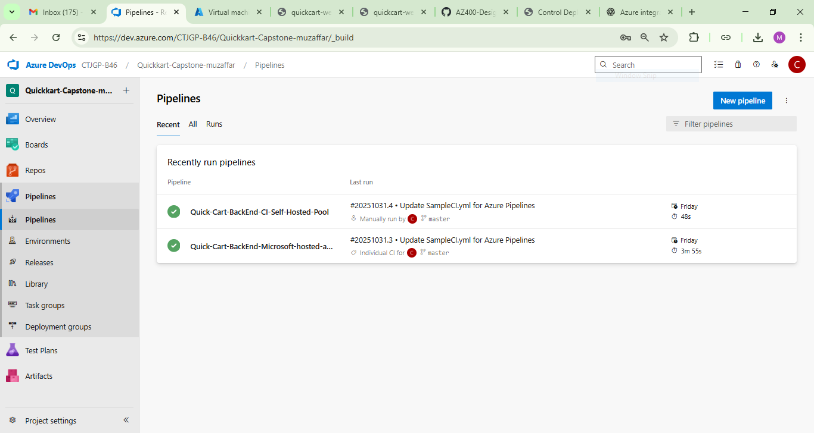
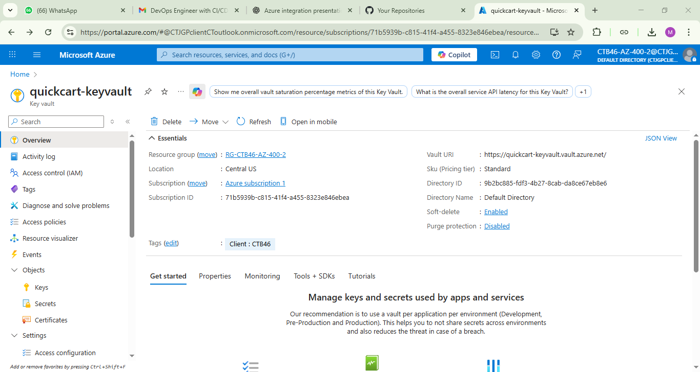
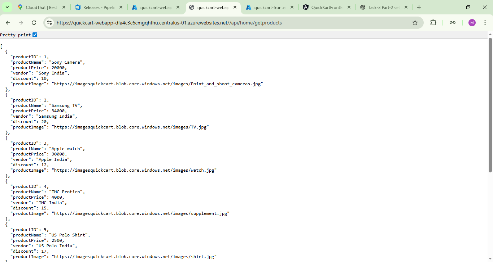
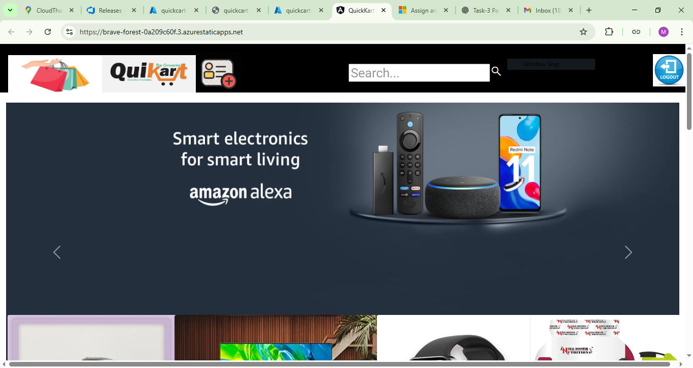

# Azure-Capstone-Project
CloudThat Azure Capstone Project – QuickKart E-Commerce App using Azure DevOps, App Service, Function App, Key Vault, and Monitoring.
# QuickKart – E-Commerce Application (Azure Capstone Project)

## Overview
QuickKart is a full-stack e-commerce web application built using Angular 13 and .NET Core 3.1, deployed entirely on Microsoft Azure.  
It demonstrates cloud-native architecture with CI/CD pipelines, serverless components, secure secret management, and monitoring.

---

## Tech Stack
- **Frontend:** Angular 13 (Azure Static Web App)
- **Backend:** .NET Core 3.1 Web API (Azure App Service)
- **Login Microservice:** Azure Function (C#)
- **Database:** Azure SQL Database
- **Storage:** Azure Blob Storage
- **Security:** Azure Key Vault, Managed Identity
- **Monitoring:** Application Insights, Azure Monitor
- **CI/CD:** Azure DevOps Pipelines (Classic UI)
- **Version Control:** GitHub / Azure Repos

---

## Architecture
![Architecture Diagram] 

---

## Key Features
- Automated build and release pipelines using Azure DevOps
- Multi-stage deployment (Test → Prod) with manual approvals
- Post-deployment gates using Azure Monitor
- Secrets managed securely with Azure Key Vault
- Blob Storage lifecycle policies to optimize cost
- Serverless login API using Azure Function App
- Application Insights for full-stack monitoring

---
## Screenshots/

---

## 📸 Project Screenshots

### CI/CD Pipelines

### Azure Key Vault

### Deployment Slots

### QuickKart Apps

### Application Insights

---

